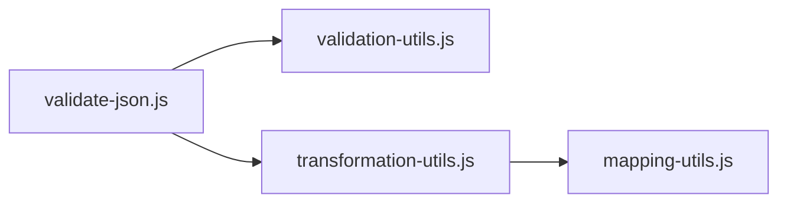
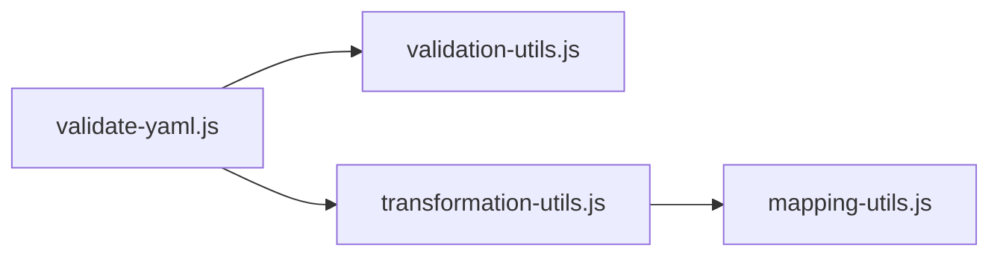
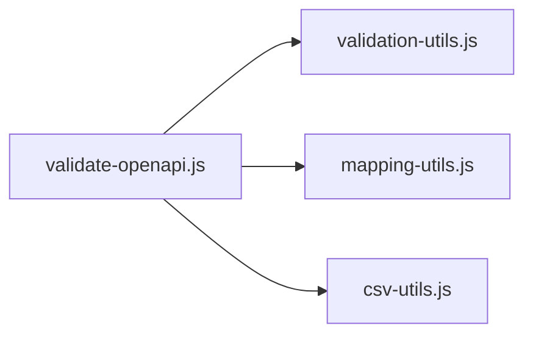
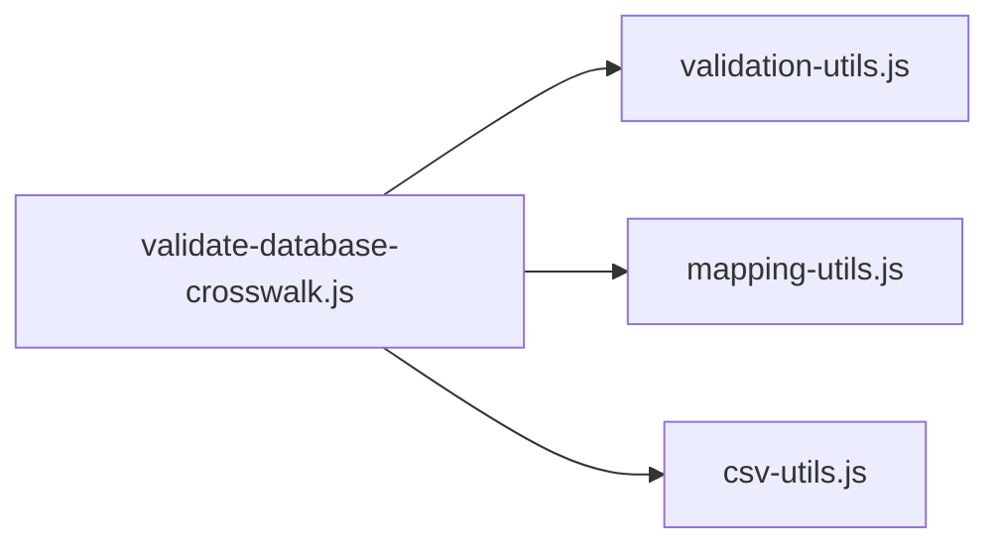
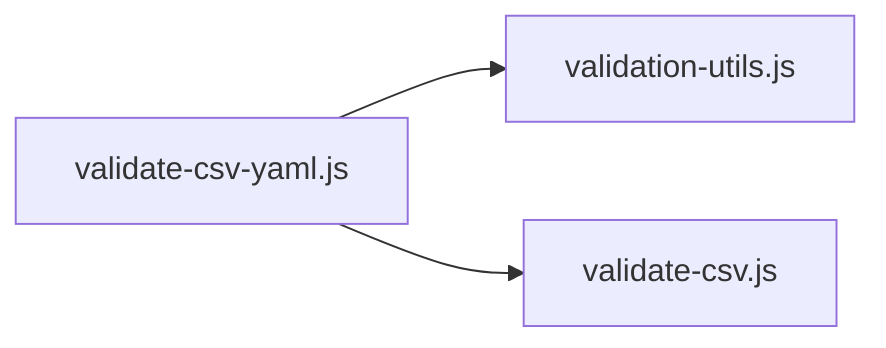
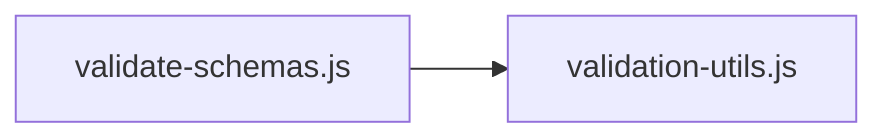
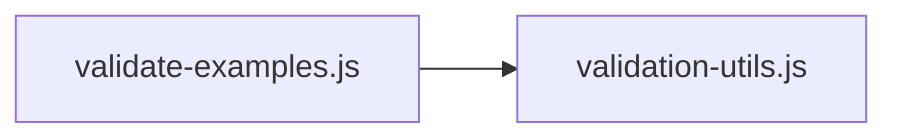
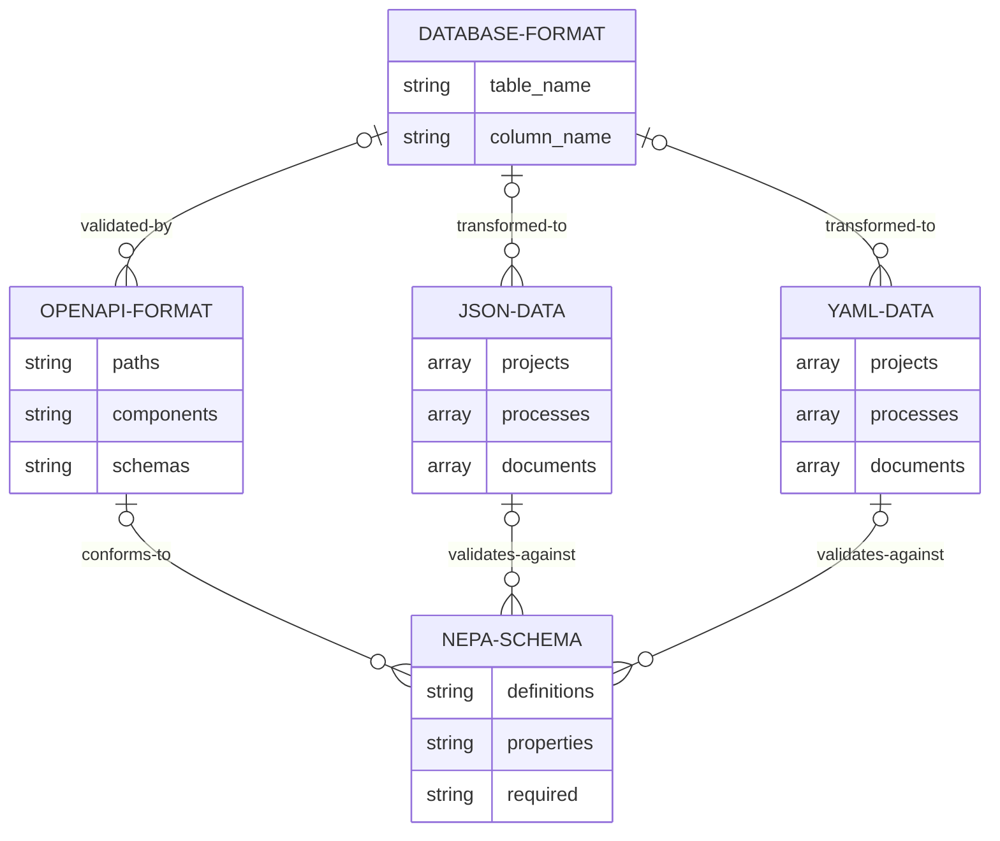

# PIC Standards Scripts

This directory contains scripts for validating and transforming various file formats against the NEPA schema standard.

## Utility Modules

The scripts share common functionality through utility modules in the `utils/` directory:

### validation-utils.js

Provides core validation functionality for multiple file formats.

- **ValidationUtils (class)** - Handles schema loading, file finding, validation and reporting
- **createValidator()** - Creates an AJV validator with standard configuration
- **loadSchemaFile()** - Loads JSON schema file with error handling
- **findJsonFiles()** - Recursively finds JSON files in directories
- **validateJsonFile()** - Validates a single JSON file against a schema
- **printSummary()** - Formats and prints validation results summary
- **colors** - Constants for terminal color output

### mapping-utils.js

Handles field mappings between database, OpenAPI, and NEPA schema formats.

- **mapStatus()** - Maps status values between formats (e.g., "In Progress" → "in-progress")
- **mapDocumentType()** - Maps document types (e.g., "FEIS" → "Final EIS")
- **mapEngagementType()** - Maps engagement types (e.g., "hearing" → "public hearing")
- **mapEventStatus()** - Maps event status values between formats
- **shouldIgnoreField()** - Determines if a field should be ignored during validation
- **mapEntityId()** - Maps entity ID field names between formats
- **mapDatabaseFieldToSchema()** - Maps database column names to schema property names
- **getSchemaMapping()** - Gets schema mapping information for a database table
- **hasField()** - Checks if a column exists in the database columns array

### transformation-utils.js

Handles data transformation between database format and NEPA schema format.

- **transformToNepaFormat()** - Main function to transform database format to NEPA format
- **transformProjects()** - Transforms project data
- **transformProcesses()** - Transforms process data
- **transformDocuments()** - Transforms document data
- **transformComments()** - Transforms comment data
- **transformEngagements()** - Transforms engagement data
- **transformCaseEvents()** - Transforms case event data
- **transformGisData()** - Transforms GIS data
- **transformRemainingEntities()** - Transforms other entity types

### csv-utils.js

Handles CSV file operations and data processing.

- **loadCsvFile()** - Loads and parses CSV file into array of objects
- **loadDatabaseCrosswalk()** - Parses database crosswalk CSV into organized structure
- **validateCsvStructure()** - Validates CSV structure and content
- **getUniqueColumnValues()** - Gets unique values from a CSV column
- **groupCsvData()** - Groups CSV data by a specific column

## Script Dependencies

### validate-json.js

Validates JSON files against the NEPA schema.



### validate-yaml.js

Validates YAML files against the NEPA schema.



### validate-openapi.js

Validates OpenAPI specifications against NEPA schema.



### validate-database-crosswalk.js

Validates database crosswalk CSV against the NEPA schema.



### validate-csv-yaml.js

Combined validation for CSV and YAML files.



### validate-schemas.js

Validates schema files for syntax and structure.



### validate-examples.js

Validates example files against schemas.



## Entity Relationships

The scripts validate and transform data between several formats:



## Usage

Most scripts can be run directly or used as modules:

```
npm run validate:json
npm run validate:yaml
npm run validate:openapi
npm run validate:crosswalk
npm run validate:schemas
npm run validate:all
```